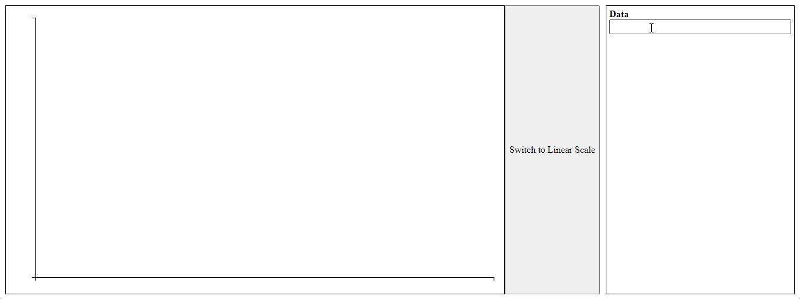
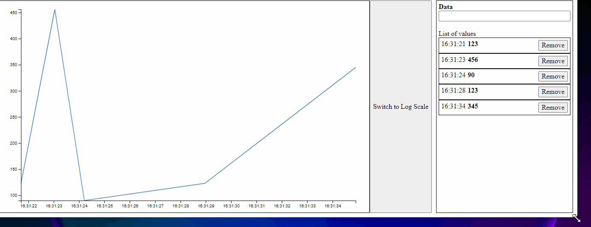
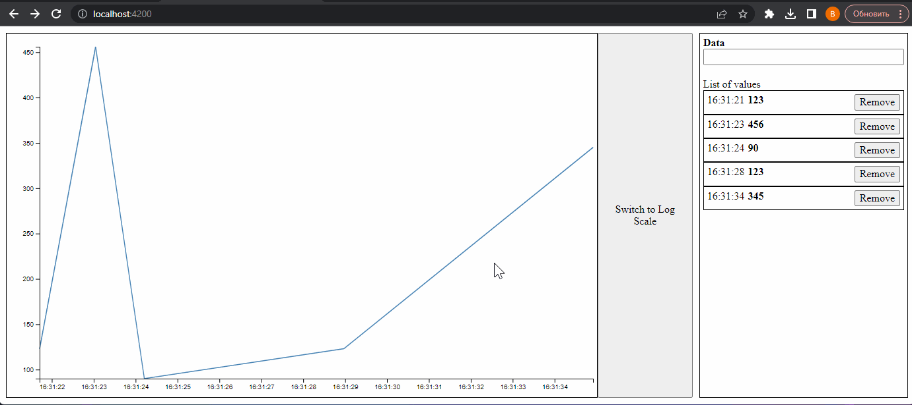
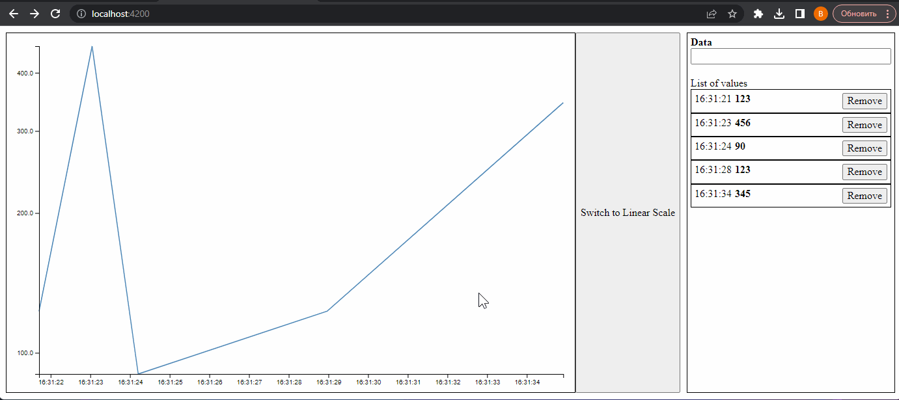

# Time Scale App

Web application for visualizing time series as a line graph
based on the d3.js library.

## Features

### Add and remove values



### Adaptive chart



### Save data after page refresh



### Logarithmic scale



## How to run

```bash
npm i
npm run start
```

Enjoy! 🙂
